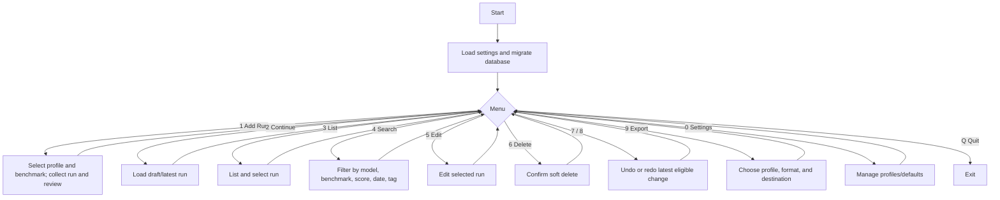

# Phase 0 architecture

## Domain data classes

```text
ModelProfile
  id, name, model_name, model_family, model_size, quantization, backend
  temperature, top_p, top_k, min_p, thinking_enabled, flash_attention
  moe_experts, context_length, tokens_per_second

HardwareProfile
  id, name, cpu, gpu, vram_gb, ram_gb, operating_system, backend_versions
  notes, created_at, updated_at

BenchmarkSession
  id, title, description, started_at, completed_at, notes, created_at
  updated_at, is_deleted

BenchmarkDefinition
  id, name, file_path, benchmark_type, default_prompt, tags, is_active

PromptTemplate
  id, name, version, prompt_text, prompt_hash, benchmark_type, notes
  created_at, updated_at, is_active

ReviewScore
  id, run_id, accuracy_score, hallucination_level, reliability_level
  depth_score, signal_noise_score, actionability_score, seniority_score
  overall_score, strengths, weaknesses, verdict, notes

BenchmarkRun
  id, session_id?, model_profile_id?, benchmark_definition_id?
  prompt_template_id?, hardware_profile_id?, model_snapshot, benchmark_snapshot
  prompt_snapshot, hardware_snapshot, prompt_name, prompt_text, raw_model_output
  review_score?, fingerprint, created_at, updated_at, is_deleted

RunAttachment
  id, run_id, attachment_type, file_path, original_filename, notes, created_at

ExportProfile
  id, name, format, field_selection, filter_json, destination, created_at
```

`BenchmarkRun` owns model, prompt, benchmark, and hardware snapshots rather than
relying solely on foreign keys. A `BenchmarkSession` groups related runs from a
single test batch. `RunAttachment` is a child of a run and identifies external
screenshots, logs, raw text, or other artifacts. `ReviewScore` is separate to
keep context and subjective evaluation clear, while the engine returns an
aggregate `BenchmarkRun` object for callers.

## Engine boundaries

```text
CLI / future PySide6 GUI / importer / exporter
                  |
             Application services
 Sessions | Profiles | Definitions | Templates | Hardware | Runs
 Attachments | Scores | Export | Undo/Redo | Search | Statistics
                  |
        Repositories + migration runner (SQLite)
                  |
             Domain data classes
```

Services accept and return data classes; they do not read input, print output,
or know which user interface invoked them. Basic CRUD is the Phase 1 priority.
Each later mutation will write one matching `change_history` event in the same
database transaction. Undo applies the event's `before_json`; redo applies
`after_json`. A new mutation after undo invalidates the redo branch.

## CLI flow (Phase 2)



## Future GUI wireframe (Phase 5)

```text
+---------------------------------------------------------------+
| Local LLM Benchmark Recorder       [+ Add Run] [Export] [Settings] |
+---------------------+-----------------------------------------+
| Dashboard           | Recent benchmarks                       |
| Runs                | Model        Benchmark       Overall   |
| Models              | Qwen ...     speech_server     4.6     |
| Benchmarks          | ...                                     |
| Exports             +-----------------------------------------+
|                     | Score trend          Leaderboard       |
|                     | [line chart]         [ranked table]   |
+---------------------+-----------------------------------------+
```
